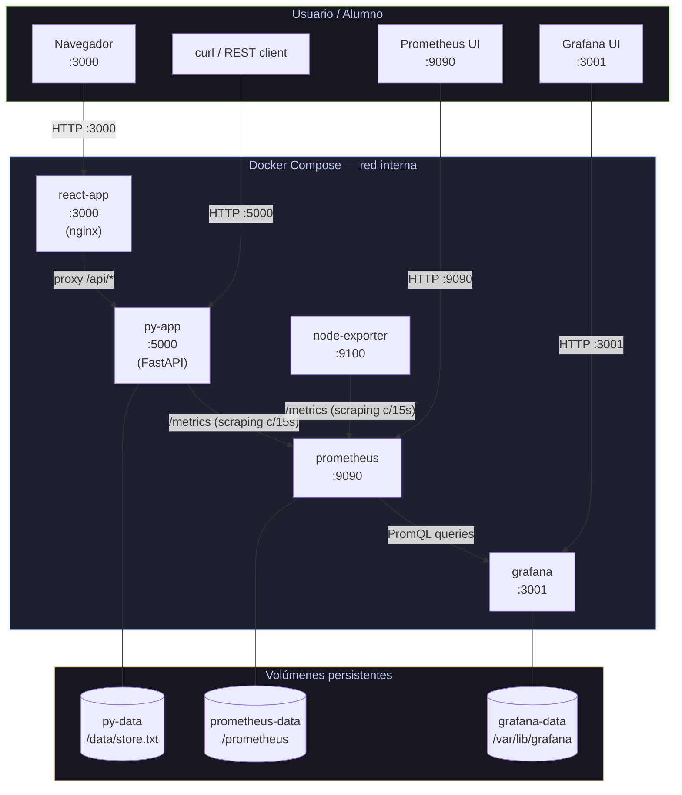
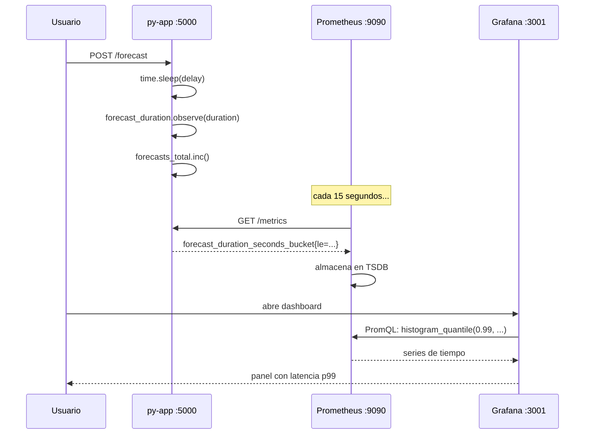

# Guía: Levantar el Stack de Monitoreo

## Arquitectura



### Flujo de métricas



---

## Prerequisitos

- Docker Desktop corriendo
- Puertos libres: `3000`, `3001`, `5000`, `9090`, `9100`

---

## 1 — Levantar todo

```bash
docker compose up -d --build
```

Verificar que los 5 servicios estén arriba:

```bash
docker compose ps
```

Salida esperada (todos `running`):

```
NAME            IMAGE                          STATUS
py-app          ...                            running
react-app       ...                            running
prometheus      prom/prometheus:v2.51.0        running
grafana         grafana/grafana:10.4.0         running
node-exporter   prom/node-exporter:v1.7.0      running
```

Si algún servicio falla:

```bash
docker compose logs <nombre-servicio>
```

---

## 2 — Verificar Prometheus

Abrir `http://localhost:9090`

### 2.1 — Verificar que los targets están UP

`Status → Targets`

Deben aparecer 3 targets, todos en estado **UP**:
- `py-app` → `http://py-app:5000/metrics`
- `node-exporter` → `http://node-exporter:9100/metrics`
- `prometheus` → `http://localhost:9090/metrics`

> Si `py-app` aparece **DOWN**: revisar que el contenedor esté corriendo y que `/metrics` responde:
> ```bash
> curl http://localhost:5000/metrics | head -20
> ```

### 2.2 — Probar una query PromQL

En el campo de Expression, pegar y ejecutar:

```
up
```

Debe devolver 3 series con valor 1.

---

## 3 — Abrir Grafana

Abrir `http://localhost:3001`

- **Usuario:** `admin`
- **Contraseña:** `admin`

> El datasource de Prometheus y el dashboard ya están auto-provisionados.
> Ir a **Dashboards → Browse → "Sistema de Monitoreo — py-app"**.

---

## 4 — Generar tráfico para poblar los dashboards

Sin tráfico, los paneles muestran "No data". Usar estos comandos para generar actividad.

### 4.1 — Forecast con latencia normal (~1s)

```bash
curl -s -X POST http://localhost:5000/forecast \
  -H "Content-Type: application/json" \
  -d '{"delay": 1.0}' | python3 -m json.tool
```

### 4.2 — Forecast con latencia aleatoria (demo de percentiles)

```bash
# Repetir 20 veces con latencia aleatoria (0.3s - 7s)
for i in $(seq 1 20); do
  curl -s -X POST http://localhost:5000/forecast \
    -H "Content-Type: application/json" \
    -d '{}' &
done
wait
```

### 4.3 — Forecast que viola el KPI (> 5s)

```bash
# Forzar 6 segundos de latencia → viola el SLA
curl -s -X POST http://localhost:5000/forecast \
  -H "Content-Type: application/json" \
  -d '{"delay": 6.0}' | python3 -m json.tool
```

Observar en Grafana: el panel **"Latencia p99 Actual"** debe ponerse **rojo**.

### 4.4 — Generar errores 5xx (para probar alerta de error rate)

```bash
for i in $(seq 1 10); do
  curl -s -X POST http://localhost:5000/forecast \
    -H "Content-Type: application/json" \
    -d '{"simulate_error": true}'
done
```

Observar: el panel **"Error Rate %"** debe subir.

### 4.5 — Simular carga sostenida de forecasts

```bash
curl -s -X POST http://localhost:5000/simulate/load \
  -H "Content-Type: application/json" \
  -d '{"count": 30, "endpoint": "/forecast", "delay_between": 0.2}' \
  | python3 -m json.tool
```

> Nota: `/simulate/load` actualiza las métricas custom (`forecasts_total`, `forecast_duration_seconds`, etc.) pero NO genera tráfico HTTP visible en el panel "Requests por segundo". Para ese panel, usar los comandos curl directamente.

### 4.6 — Guardar y leer datos

```bash
# Guardar entradas
for i in $(seq 1 15); do
  curl -s -X POST http://localhost:5000/save \
    -H "Content-Type: application/json" \
    -d "{\"content\": \"entrada de prueba $i\"}"
done

# Leer (simula integración externa)
for i in $(seq 1 5); do
  curl -s http://localhost:5000/read > /dev/null
done
```

Observar: el gauge **"Entradas Almacenadas en Disco"** debe subir a ~15.

---

## 5 — Simular una caída del servicio

Esta demo muestra la alerta de **Servicio Caído** y cómo el panel de estado pasa a rojo.

```bash
# Detener py-app
docker compose stop py-app
```

Observar en Grafana (puede tardar ~15-30s en reflejarse):
- Panel **"Estado del Servicio"** → **CAÍDO** (rojo)
- Panel **"Uptime %"** → baja

En Prometheus (`http://localhost:9090/alerts`):
- La alerta `ServicioCaido` pasa a **Pending** → **Firing** (después de 1 minuto)

```bash
# Restaurar el servicio
docker compose start py-app
```

---

## 6 — Configurar alertas en Grafana (ejercicio en clase)

### 6.1 — Crear un Contact Point para notificaciones

1. Ir a `http://webhook.site` y copiar tu URL única
2. En Grafana: **Alerting → Contact points**
3. Editar `webhook-clase` y pegar la URL de webhook.site
4. Click **Test** para verificar que llega el payload

### 6.2 — Crear una regla de alerta para latencia alta

1. Ir a **Alerting → Alert rules → New alert rule**
2. Configurar:
   - **Nombre:** Latencia Forecast Alta
   - **Query A (Prometheus):**
     ```
     histogram_quantile(0.95, sum(rate(forecast_duration_seconds_bucket[5m])) by (le))
     ```
   - **Condition:** IS ABOVE `5`
   - **Evaluate every:** `1m` / **For:** `2m`
   - **Labels:** `severity=warning`
3. Guardar

4. Disparar la alerta:
   ```bash
   # Generar forecasts lentos para cruzar el umbral
   for i in $(seq 1 5); do
     curl -s -X POST http://localhost:5000/forecast \
       -H "Content-Type: application/json" \
       -d '{"delay": 6.5}' &
   done
   wait
   ```

5. Esperar ~2 minutos y verificar en webhook.site que llegó la notificación.

---

## 7 — Referencia de endpoints

| Método | Endpoint | Descripción |
|--------|----------|-------------|
| GET | `http://localhost:5000/health` | Health check |
| POST | `http://localhost:5000/save` | Guardar contenido en disco |
| GET | `http://localhost:5000/read` | Leer contenido del disco |
| POST | `http://localhost:5000/forecast` | Generar forecast (con latencia) |
| GET | `http://localhost:5000/forecast/history` | Historial de forecasts |
| POST | `http://localhost:5000/simulate/load` | Carga artificial (métricas custom) |
| GET | `http://localhost:5000/metrics` | Métricas en formato Prometheus |
| GET | `http://localhost:9090` | UI de Prometheus |
| GET | `http://localhost:3001` | UI de Grafana (admin/admin) |

### Parámetros de `/forecast`

```json
{
  "delay": 2.5,           // segundos de procesamiento (null = aleatorio 0.3-7s)
  "simulate_error": false // true → retorna HTTP 500
}
```

### Parámetros de `/simulate/load`

```json
{
  "count": 20,           // cantidad de iteraciones
  "endpoint": "/forecast", // "/forecast" | "/save" | "/read"
  "delay_between": 0.1   // segundos entre iteraciones
}
```

---

## 8 — Queries PromQL útiles para explorar en clase

Pegar en `http://localhost:9090` o en el explorador de Grafana (**Explore**):

```promql
# Todos los servicios que Prometheus está monitoreando
up

# Tasa de requests totales por segundo (últimos 5 min)
sum(rate(http_request_duration_seconds_count{job="py-app"}[5m]))

# Requests desglosados por endpoint
sum by(handler) (rate(http_request_duration_seconds_count{job="py-app"}[1m]))

# Percentil 99 de latencia de forecast
histogram_quantile(0.99, sum(rate(forecast_duration_seconds_bucket[5m])) by (le))

# Error rate en porcentaje
sum(rate(http_request_duration_seconds_count{status_code=~"5..",job="py-app"}[5m]))
/ sum(rate(http_request_duration_seconds_count{job="py-app"}[5m])) * 100

# CPU del host
100 - (avg by(instance) (rate(node_cpu_seconds_total{mode="idle"}[5m])) * 100)

# Memoria usada %
(node_memory_MemTotal_bytes - node_memory_MemAvailable_bytes)
/ node_memory_MemTotal_bytes * 100

# Forecasts que violaron el SLA (> 5s)
forecasts_total - sum(rate(forecast_duration_seconds_bucket{le="5.0"}[5m]))

# Estado de alertas de Prometheus
ALERTS{alertstate="firing"}
```

---

## 9 — Detener y limpiar

```bash
# Solo detener (mantiene los volúmenes / datos)
docker compose down

# Detener y borrar todo (volúmenes incluidos)
docker compose down -v
```
